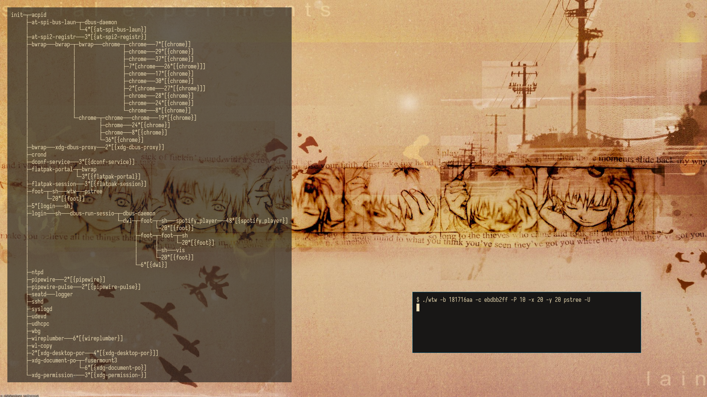

# wtw

wtw is a simple text widget for wlroots; ported from [stw](https://github.com/sineemore/stw), with wtw inheriting it's behavior.

## Dependencies
* wlroots
* wayland-protocols \*
* fcft
* pixman
* `memfd_create`
* wlroots compositor supporting `zwlr-layer-shell-unstable-v1`

\* _compile-time dependency_
